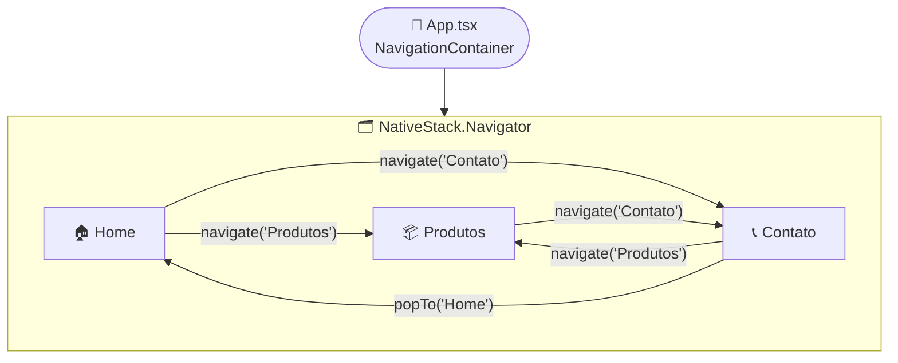
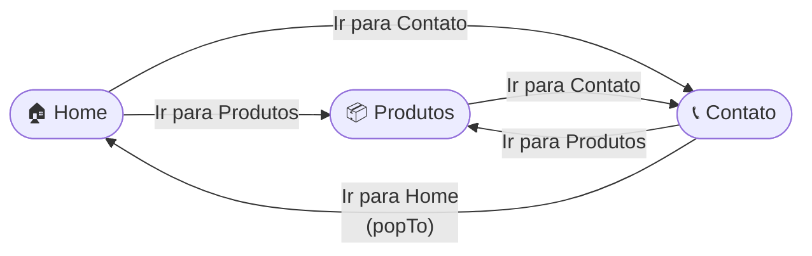

# 📱 Tech Store App

<div align="center">


</div>

> Aplicação mobile desenvolvida com **React Native**, **Expo** e **TypeScript**, explorando navegação em pilha (**Stack Navigation**) com `@react-navigation/native-stack`. O projeto simula uma loja de tecnologia com três telas interligadas.

---

## 📋 Sumário

- [Visão Geral](#-visão-geral)
- [Estrutura do Projeto](#-estrutura-do-projeto)
- [Telas](#-telas)
- [Navegação](#-navegação)
- [Tecnologias](#️-tecnologias)
- [Como Executar](#-como-executar)

---

## 🔎 Visão Geral

O **Tech Store App** é um projeto acadêmico focado em explorar os fundamentos de **navegação em pilha** no React Native. A aplicação simula uma loja virtual com produtos eletrônicos, apresentando:

- Navegação tipada com `RootStackParamList`
- Tipagem de props de tela via `NativeStackScreenProps`
- Controle de estado local com `useState` para contadores de quantidade
- Layout responsivo com `SafeAreaView`, `ScrollView` e `StyleSheet`
- Assets locais para exibição de imagens de produtos

---

## 📁 Estrutura do Projeto

```
├── 📁 assets
│   ├── 🖼️ favicon.png
│   ├── 🖼️ fone.jpg
│   ├── 🖼️ icon.png
│   ├── 🖼️ monitor.jpg
│   ├── 🖼️ mouse.jpg
│   ├── 🖼️ splash-icon.png
│   ├── 🖼️ tablet.jpg
│   └── 🖼️ teclado.jpg
├── 📁 src
│   └── 📁 screens
│       ├── 📁 Contatos
│       │   └── 📄 index.tsx
│       ├── 📁 Home
│       │   └── 📄 index.tsx
│       └── 📁 Produtos
│           └── 📄 index.tsx
├── ⚙️ .gitignore
├── 📄 App.tsx
├── ⚙️ app.json
├── 📄 index.ts
├── ⚙️ package.json
└── ⚙️ tsconfig.json
```

---

## 🖥️ Telas

### 🏠 Home

Tela inicial da aplicação. Apresenta o logo, nome e descrição da loja, destaques institucionais e botões de navegação para as demais telas.

- Exibe imagem via URI remota (Picsum)
- Destaques: entrega por drone, produtos eletrônicos e desconto no PIX
- Navega para `Produtos` e `Contato`

---

### 📦 Produtos

Tela de listagem de produtos com suporte a **contagem de quantidade individual** por item.

| Produto                        | Preço       |
| ------------------------------ | ----------- |
| Tablet - Samsung Galaxy Tab S7 | R$ 2.499,00 |
| Teclado - Logitech K380        | R$ 299,00   |
| Fone de Ouvido - Sony WH       | R$ 1.499,00 |
| Mouse - Razer Viper v3 Pro     | R$ 1.199,00 |
| Monitor - LG UltraFine 4K      | R$ 3.999,00 |

- Cada produto exibe imagem local (de `assets/`), nome, preço e controles `+` / `−`
- Quantidade mínima por produto: 1
- Botão "Adicionar ao Carrinho" com feedback via `alert`
- Navega para `Contato`

---

### 📞 Contato

Tela institucional com informações da empresa.

- Telefones de contato
- Endereço físico
- CNPJ
- Horário de atendimento
- E-mail de contato
- Navega para `Home` (via `popTo`) e para `Produtos`

---

## 🧭 Navegação

O projeto utiliza **Stack Navigation** do `@react-navigation/native-stack`, com tipagem centralizada em `App.tsx` via `RootStackParamList`.



### Tipagem da Navegação

Cada tela é tipada com `NativeStackScreenProps` recebendo o `RootStackParamList` e o nome da rota correspondente:

```typescript
// Definição em App.tsx
export type RootStackParamList = {
  Home: undefined;
  Produtos: undefined;
  Contato: undefined;
};

// Uso em cada tela
type Props = NativeStackScreenProps<RootStackParamList, "Home">;
export default function Home({ navigation }: Props) { ... }
```

### Métodos de Navegação Utilizados

| Método           | Utilização                               | Comportamento                               |
| ---------------- | ---------------------------------------- | ------------------------------------------- |
| `navigate(rota)` | Ir para `Produtos` ou `Contato`          | Empilha a tela de destino                   |
| `popTo(rota)`    | Voltar para `Home` a partir de `Contato` | Remove telas da pilha até chegar ao destino |

---

## 🛠️ Tecnologias

### Dependências de Produção

| Pacote                           | Versão  | Uso                                    |
| -------------------------------- | ------- | -------------------------------------- |
| `expo`                           | ~55.x   | Plataforma de desenvolvimento mobile   |
| `react`                          | ^19.x   | Biblioteca de UI                       |
| `react-native`                   | ^0.83.x | Framework mobile                       |
| `@react-navigation/native`       | ^7.x    | Infraestrutura de navegação            |
| `@react-navigation/native-stack` | ^7.x    | Navegação em pilha nativa              |
| `react-native-safe-area-context` | ^5.x    | Áreas seguras (notch, barra de status) |
| `expo-status-bar`                | ~55.x   | Controle da barra de status            |
| `@expo/vector-icons`             | ^15.x   | Ícones vetoriais                       |

### Dependências de Desenvolvimento

| Pacote         | Versão | Uso                            |
| -------------- | ------ | ------------------------------ |
| `typescript`   | ~5.9.x | Linguagem com tipagem estática |
| `@types/react` | ~19.x  | Tipagens do React              |

---

## 🗺️ Fluxo de Telas



---

<div align="center">
  <sub>Projeto Acadêmico Mobile SENAI — React Native · Expo · TypeScript · Stack Navigation</sub>
</div>
